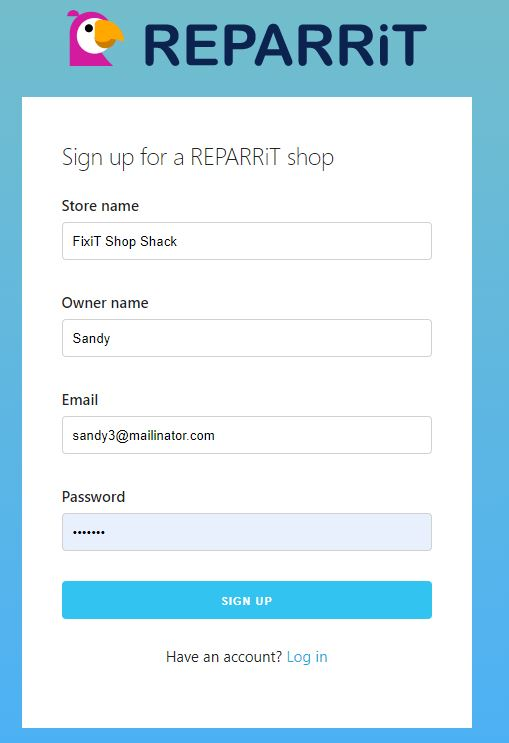
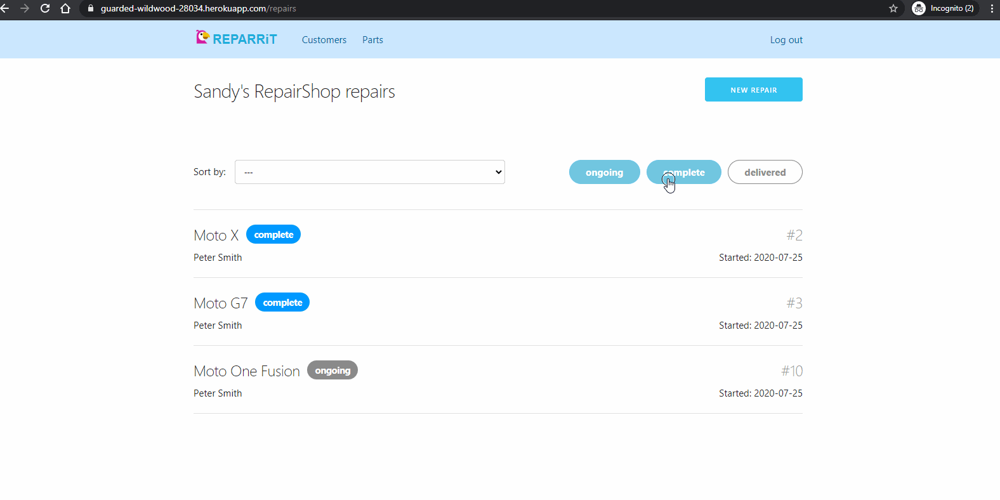
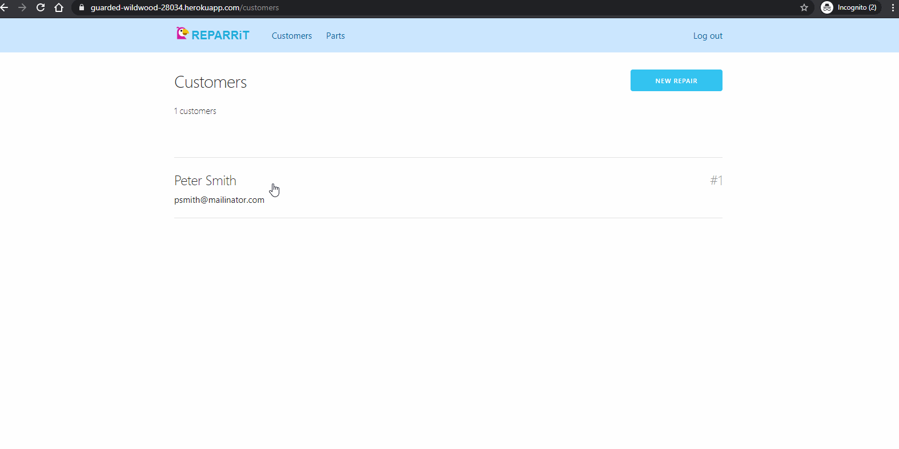
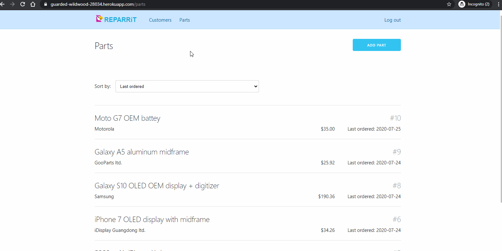
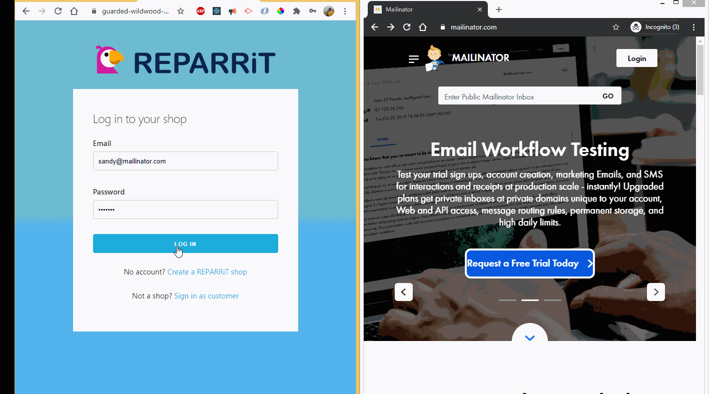

# REPARRiT

REPARRiT is a platform that empwoers any kind of repair-shop owner to start tracking the reliability of the parts that they put in the
repair jobs and thereby offer an optimum warranty price that is profitable and at the time a fair price for their customer.

## Table of Contents

- [Description](#Description)
- [TechStack](#TechStack)
- [Usage](#Usage)
- [Credits](#Credits)
- [License](#License)
- [Contributing](#Contributing)
- [Tests](#Tests)
- [Questions](#Questions)

## Description

The REPARRiT platform allows shop owners to register their shop and start using our analytics services right away. The shop owners can create new accounts for their customers as they walk-in to their shop for a repair OR if the customer already has an account on REPARRiT then they can select the customer and start the repair for them. The customer gets an email with login credentials when an account is created for them and when the shop starts working on their repair.

When the shop owner creates a repair they may choose to add parts to the repair from their inventory or the may register a new part that belongs to the device being repaired. In order to add a new part in the system, the shop owners are required to enter the supplier information and price of the part. The shop owner may also add a new batch of an already registered part into the system.

When the shop owner completes the repair, they can enter the labor cost to the repair and mark it complete. The labor cost and price of all the parts put in the repair are saved as the total cost of the repair and the customer gets an email notification that their device is ready for pick.

The customer can logon to their REPARRiT account and check the status of their device repair. Of course, a customer may have repairs belonging to many shops. Their repair history is saved.

A shop owner can offer a warranty to the customer on the repair job. The warranty prices are suggested by our algorithm to the shop owner. The warranty suggestion algorithm factors in the probability of a part failure and the duration of the warranty.

If a customer's repaired device breaks down in the warranty period. They can bring their device in the shop to initiate a warranty claim. When that happens and the shop owner replaces a part, it is recorded as a data-point. The recorded failure data-point then influences the suggested warranty price for a future repair job that included the failing part.

The app is deployed using Heroku at -
https://guarded-wildwood-28034.herokuapp.com/

## TechStack

In simple terms, our Tech Stack is - React JS on the front-end and Node/ Express backed by MYSQL server on the backend. Below is the list of the technologies used -

- FRONTEND

  - React.js
  - React router
  - Skeleton CSS
  - SASS
  - Responsive design

- BACKEND
  - Node.js
  - MySQL / Sequelize
  - Nodemailer
  - Passport JS
  - Express

## Usage

- Shop owners

  - Navigate to the home page and register your shop with an email and a shop name.
  - Log in and view your repair job history and in-progress repair jobs.
  - Create a new repair for an existing customers or add a new customer.
  - Add parts to the repair job or add new parts into the system OR add a new batch for a particular part.
  - View a specific part and view part statistics like faiure rate, total number of installs in past one year.
  - Add a warranty to a completed repair using the suggested price as a guide.

- Customers

  - Recieve login credentials in email.
  - Login to their account to track all of their ongoing and past repairs.
  - View each repair to find out which parts were used in the repair.
  - Recieve an update when device is ready for pick up.

## Credits

PeterTYLiu(https://github.com/PeterTYLiu)
sandyboon(https://github.com/sandyboon)

## License

Licensed under the MIT license.

## Contributing

Please reach out to us on our contact email for colloborating on this or any other project.

## Questions

### Email : sandy.boon@gmail.com, Peter.TY.Liu@gmail.com
